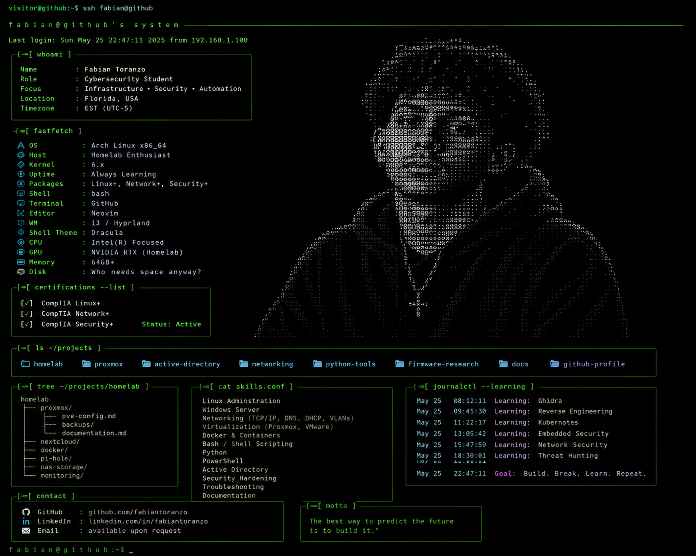

# Fabian-Toranzo
<table>
<tr>
<td width="55%" valign="top">


---

# 👋 Hi, I'm Fabian Toranzo

```console
visitor@github:~$ whoami

Fabian Toranzo
B.S. Cybersecurity Student
Miami Dade College 

Current Goal:
→ Systems Administrator
```

## 🎓 Education

```console
visitor@github:~$ education

Institution : Miami Dade College
Degree      : Bachelor of Science in Cybersecurity
Program     : NSA Designated National Center of Academic Excellence
Status      : Currently Enrolled
```
</td>

<td width="45%" valign="top" align="center">



</td>
</tr>
</table>

## 📜 Certifications

```console
visitor@github:~$ certs --list

[✓] CompTIA Linux+
[✓] CompTIA Network+
[✓] CompTIA Security+
```

## 🖥️ Homelab

```console
visitor@github:~$ ls ~/homelab

Dell PowerEdge T620
├── Proxmox VE
├── Virtual Machines
├── Linux
├── Windows Server
└── Self-hosted Raid Cloud
```

## 💡 Interests

```console
visitor@github:~$ cat interests.txt

• Enterprise Infrastructure
• Linux Administration
• Windows Server
• Networking
• Virtualization
• Self-hosting
• Cybersecurity
```

## 🎯 Five-Year Goal

```console
visitor@github:~$ roadmap

Current
└── B.S. Cybersecurity Student

↓

Hands-on Infrastructure Experience

↓

Systems Administrator

↓

Senior Infrastructure / Server Administrator
```

## 📚 Currently Learning

```console
visitor@github:~$ learning

> Linux Administration
> Windows Server
> Active Directory
> Networking
> Virtualization
> PowerShell
> Python
```

## 🤝 Looking for a Mentor

I'm actively looking for someone experienced in infrastructure, Linux, Windows Server, or networking who enjoys teaching.

If you're willing to answer questions, review projects, or provide guidance as I grow, I'd genuinely appreciate connecting with you.

I'm always building, learning, and open to feedback.
